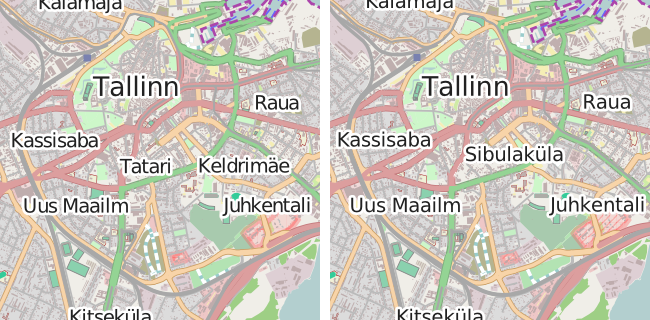

# Nik4

This is a mapnik-to-image exporting script. It requires only `mapnik-python` bindings.
Run it with `-h` option to see available options and their descriptions.

## Why is it better

Nik4 takes great care to preserve values you feed it. If you say you need a 800×600 image,
it won't take a pixel less or more. It won't shrink a bounding box or distort lines when
specifying so called "scale factor". When you need a 300 dpi image, you tell it `--ppi 300`
and can be sure you will get what you intended.

For example, this is a sample rendering of an area in Talling on zoom 17, by Nik4, Nik2img
and as seen on the default layer on osm.org:

Also it can use real-world units, that is, millimeters (and prefers to). Specify dimensions
for printing, choose bounding box and ppi scale — and the result won't disappoint.

## How to use it

Again, run `./nik4.py -h` to see the list of all available options. Here are some examples.

*todo*

### Watching a mapping party area

### Export an area around Apoint

### Get an image for printing

### Generate a vector drawing from a map

## See also

* [mapnik/demo/python](https://github.com/mapnik/mapnik/tree/master/demo/python)
* [generate\_image.py](http://svn.openstreetmap.org/applications/rendering/mapnik/generate_image.py)
* [mapnik-render-image](https://github.com/plepe/mapnik-render-image)
* [osm.org/export](https://trac.openstreetmap.org/browser/sites/tile.openstreetmap.org/cgi-bin/export)
* [nik2img](http://code.google.com/p/mapnik-utils/wiki/Nik2Img)

For generating tiles, see [polytiles.py](https://github.com/Zverik/polytiles).
